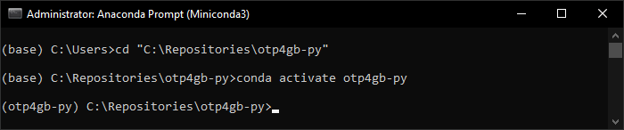

# OTP4GB-py

This tool is a Python wrapper around [Open Trip Planner (OTP) v2](https://docs.opentripplanner.org/en/v2.1.0/)
which produces cost metrics for public transport routing between given positions in Great Britain.

This is an updated version of OTP4GB-py produced by Open Innovations (available at
[github.com/open-innovations/otp4gb-py](https://github.com/open-innovations/otp4gb-py)),
which itself is a port of the [OTP4GB](https://github.com/odileeds/OTP4GB) tool written
by Tom Forth at Open Innovations.

## Overview
This flowchart details the full OTP4GB-Py routing and cost calculation process. The process is
split into two steps prepare and routing which correspond to the [Prepare](#prepare) and
[Process](#process) scripts, which are discussed in the respective sections below.


## Preparation and dependencies
In order to use the OTP4GB-Py tool, please clone, or download, this repository to your local machine.
The OTP4GB-Py process requires both Java and Python to be installed in order to run, this section
outlines the installation of both pieces of software and some additional dependancies.

### Java
Java Standard Edition Development Kit (JDK) is required for running the OTP server.
JDK installers are available for Windows, Mac and Linux[^1] from
[Oracle's website](https://www.oracle.com/uk/java/technologies/downloads/#jdk17-windows).

Once installed you can check the installation has completed correctly and you have the correct
version using the command `java --version`. If this command fails make sure JDK has been added to
the PATH environment variable.

### Python
This section outlines the installation of Python and the installation of the dependancies required
for OTP4GB-Py. For this tool the recommended method for installing Python and it's dependancies
would be to use Miniconda from the Anaconda Prompt, although Anconda Navigator or Python's built-in
pip could be used. Miniconda installers are avaiable from the
[conda website](https://docs.conda.io/en/latest/miniconda.html), the 64-bit version should be used.

Once installed, run "Anaconda Prompt (Miniconda3)" to open a command prompt with access to the
conda commands then run the following commands.

- Move to the OTP4GB-Py directory: `cd "path\to\otp4gb-py"`
- Create a new conda environment and install the dependancies (this may take a few minutes to
  complete): `conda create -n otp4gb-py --file requirements.txt -y -c conda-forge`
- Activate the environment: `conda activate otp4gb-py`

**Note:** All future commands discussed should be ran from the "Anaconda Prompt" after moving to
the OTP4GB-py directory and activating the "otp4gb-py" environment (see image below for what this
should look like).



### Tool Setup
Setting up some additional requirements for running OTP4GB-Py can be done with the `setup.py`
Python script, which is provided with the tool. Running setup is done with the command
`python setup.py`[^2], which will perform the following steps (some of which require user input).

- Firstly, the script will open a web browser and ask the user to download the Open
  Street Map (OSM) converter (osmconvert64.exe) and place it in the "bin" directory.
  The existance of this file in the correct location will be checked before the script
  moves on.
- Next the script automatically downloads and installs
  [Maven](https://maven.apache.org/) into the "bin" folder.
- Finally, it will use maven to install GTFS filter and OTP.

After the setup script has finished the bin folder should contain the following files
and folders:

- apache-maven-3.8.6: folder containing the maven installation
- lib: java dependancies
- gtfs-filter-0.1.jar: GTFS filter Java executable file
- otp-2.1.0-shaded.jar: OTP server Java executable file
- osmconvert64: OSM converter executable file

The final requirement before running the tool is to fill the "assets" directory with
all required input files. This folder should contain the following:

- GTFS zip files for all dates, times, modes and areas.
- Centroids CSV: CSV file containing all the zone centroids for the routing, with the
  following columns:
  - zone_id
  - zone_name
  - zone_system
  - latitude
  - longitude
- OSM data file for area of interest, information on downloading this file is available
  on the [OSM Wiki](https://wiki.openstreetmap.org/wiki/Downloading_data).

## Running OTP4GB-Py
This section outlines the scripts involved with running the process and outputting the cost metrics
and generalised cost matrix. Before running the process a new folder should be created for storing
the intemediary files and the outputs, this should also contain the OTP4GB-Py configuration file.

The config file should be named "config.yml" and uses the
[YAML format](https://docs.ansible.com/ansible/latest/reference_appendices/YAMLSyntax.html#yaml-syntax),
an [example config](example-config.yml) is provided and the parameters for the it are outlined
in table 1.

**Table 1:** *Details the parameters available in the config file and their default values.*

| Parameter                    | Sub-Parameter         | Type                                                             | Default                                | Description                                                                                                     |
| :--------------------------- | :-------------------- | :--------------------------------------------------------------- | :------------------------------------- | :-------------------------------------------------------------------------------------------------------------- |
| date                         | -                     | Date (YYYY-MM-DD)                                                | N/A                                    | Date on which the routing should be calculated for.                                                             |
| extents                      | min_lat               | Real                                                             | N/A                                    | Latitude and longitude bounds for the area of interest.                                                         |
| ^                            | min_lon               | Real                                                             | N/A                                    | ^                                                                                                               |
| ^                            | max_lat               | Real                                                             | N/A                                    | ^                                                                                                               |
| ^                            | max_lon               | Real                                                             | N/A                                    | ^                                                                                                               |
| osm_file                     | -                     | File name                                                        | N/A                                    | Name of the OSM data file, expected to be found in the "assets" folder.                                         |
| gtfs_files                   | -                     | List of file names                                               | N/A                                    | List of all the GTFS zip files, should be in the "assets" folder.                                               |
| time_periods                 | name                  | Text                                                             | N/A                                    | List of time periods with sub-parameter name used for naming the output folder.                                 |
| ^                            | travel_time           | Time (HH:MM)                                                     | N/A                                    | Time routes must arrive at the destination by.                                                                  |
| ^                            | search_window_minutes | Integer                                                          | Calculated based on route availability | Number of minutes before `travel_time` when routes can arrive.                                                  |
| modes                        | -                     | List of lists of modes (TRANSIT, BUS, RAIL, TRAM, WALK, BICYCLE) | N/A                                    | List of the multiple modes to be considered for routing, each item is list of modes for a single matrix output. |
| centroids                    | -                     | File name                                                        | N/A                                    | Name of the zone centroids file, should be found in the "assets" folder.                                        |
| destination_centroids        | -                     | File name                                                        | N/A                                    | **Optional** name of the centroids file for the zone destinations (if they differ).                             |
| generalised_cost_factors     | wait_time             | Real                                                             | 1.0                                    | Factors for applying to the different metrics used when calculating the generalised cost.                       |
| ^                            | transfer_number       | Real                                                             | 1.0                                    | ^                                                                                                               |
| ^                            | walk_time             | Real                                                             | 1.0                                    | ^                                                                                                               |
| ^                            | transit_time          | Real                                                             | 1.0                                    | ^                                                                                                               |
| ^                            | walk_distance         | Real                                                             | 1.0                                    | ^                                                                                                               |
| ^                            | transit_distance      | Real                                                             | 1.0                                    | ^                                                                                                               |
| iterinary_aggregation_method | -                     | MEAN or MEDIAN                                                   | MEAN                                   | Method for averaging multiple route itineraries into a single cost metric for each OD pair.                     |
| max_walk_distance            | -                     | Integer                                                          | 2500                                   | Maximum walking distance allowed on a single route.                                                             |
| number_of_threads            | -                     | 0 - 10                                                           | 0                                      | Number of threads to use when running the Python process, doesn't apply to the OTP Java server.                 |
| no_server                    | -                     | Boolean                                                          | False                                  | Turns off starting up a new OTP Java server, if this is already running.                                        |
| hostname                     | -                     | Text                                                             | localhost                              | hostname of the OTP server to connect to (or start).                                                            |
| port                         | -                     | Integer                                                          | 8080                                   | port number of the OTP server to connect to (or start).                                                         |
| crowfly_max_distance         | -                     | Integer                                                          | None                                   | Optional maximum distance which filters what OD pairs will have routing calculations done.                      |
| ruc_lookup                   | path                  | File path                                                        | None                                   | Optional zone rural urban classification lookup, used for adjusting crowfly_max_distance for specific zones.    |
| ^                            | id_column             | Text                                                             | 'zone_id'                              | Name of column containing zone IDs in `ruc_lookup`.                                                             |
| ^                            | ruc_column            | Text                                                             | 'ruc'                                  | Name of column containing rural-urban classification codes in `ruc_lookup`.                                     |
| irrelevant_destinations      | path                  | File path                                                        | None                                   | Optional CSV containing list of zones which will exclude any OD pairs if the zone is the destination.           |
| ^                            | zone_column           | Text                                                             | 'zone_id'                              | Name of column containing zone IDs in `irrelevant_destinations`.                                                |

### Prepare

This section discusses the prepare Python script, before this make sure the dependencies are
installed (see [Preparation and Dependencies](#preparation-and-dependencies)) and the output folder
with a config file has been created (see [Running OTP4GB-Py](#running-otp4gb-py)). This script
will prepare the output folder by filtering the input files and creating the OTP graph file.

Run the prepare script by calling it with the path to the output folder, with some optional
arguments[^2]:
```
python prepare.py [-F] <directory>
```

Optional command line arguments:
- `-F, --force`: Force overwrite of existing prepared files

The prepare script performs the following steps (corresponds to the "OTP4GB-Py Prepare" box in the
[Overview](#overview) flowchart):
- Filters the GTFS files based on date and extents given in the config file, outputs
  the filtered GTFS files to a new filtered folder in the output folder.
- Filters the OSM file to the extents given and outputs to the filterd folder.
- Infills the date and copies the [build config](config/build-config.json) to the filtered folder.
- Copies the [router config](config/router-config.json) to the filtered folder.
- Runs OTP to build the graph file in the filtered folder.

Once complete the output folder should contain a new sub-folder `graphs\filtered`, with all the
prepared files, ready to run the process script.

### Process

Once the output folder has been prepared then running the full OTP generalised cost calculation
process is simply running the process Python script.

Running the process script uses the same config file and output folder as was used for prepare.
Run the process script by providing a path to the output directory, command usage shown below:

```plaintext
usage: process.py [-h] [-p] folder

positional arguments:
  folder                folder containing config file and inputs

options:
  -h, --help            show this help message and exit
  -p, --save_parameters
                        save build parameters to JSON lines files and exit (default: False)
```

The main process performs the following calculations (outlined in the "OTP4GB-Py Routing" box in
the [Overview](#overview) flowchart):
- Caculates a list of all the origin-destination pairs of zones which are within the extents.
- Starts the OTP server with the inputs and graph built previously.
- Iterates through all the time periods and then modes performing the following calculations for
  each:
  - Sends a request for a route between two zones to the OTP server.
  - Saves the server response to a file.
  - Calculate the generalised cost for each itinerary returned by OTP.
  - Average the various itineraries to a single set of cost metrics per zone pair.
  - Save the cost metrics to a CSV file and the generalised costs to a square CSV matrix.

The outputs from the process are discussed in the [Outputs](#outputs) section below. This process
can take a long time to run and use a lot of CPU and RAM, see table 2 for some estimates time
scales and PC requirements for various areas.

**Table 2:** *Recommended PC requirements and rough timescales for different size runs. All estimates
are approximate and two areas of similar size could have vastly different runtimes depending on the
detail of the road / public transit network in the area.*

|        Area Size        | Number of Zones | Recommended Processors | Recommended RAM | Time Estimates |
| :---------------------: | :-------------: | :--------------------: | :-------------: | :------------: |
|           LAD           |      < 100      |           8            |      32GB       |  < half a day  |
|           LAD           |    100 - 500    |           8            |      32GB       |  < half a day  |
| A single English Region |      < 100      |           8            |      32GB       |   half a day   |
| A single English Region |    100 - 500    |           8            |      32GB       |     1 day      |
|      North England      |      < 500      |           16           |      64GB       |     1 day      |
|      Great Britain      |      < 500      |           16           |      64GB       |   1 - 2 days   |

**Note:** Generally speaking adding zones increases the required time by the square of the number of
zones added, but has minimal impact on RAM usage. Increasing the area size impacts the RAM usage and
the timescales.

### Server
Another optional script is server.py, which allows running the OTP server for an existing prepared
output folder without performing the processing calculations. The server is ran on the local machine
by default and can be connected to through a web browser at http://localhost:8080/.

Running the server script is done with the following command[^2]:
```
python server.py <directory>
```

## Outputs
This section outlines the outputs produced by the OTP cost calculation process (see
[Process](#process) section for details on running). All three outputs discussed are created for
every combination of time period and modes provided in the config file.

### Generalised Cost Matrix
This cost matrix contains the mean (or median) generalised cost calculated from each of the
itineraries provided by the OTP server. This output is saved as a CSV in the square format at
whatever zone system was provided in the input config file, the first row and column contain the
zone IDs from the zone centroids input.

### Cost Metrics
A second CSV output is the cost metrics CSV, this contains a variety of cost 

The first six columns contain the name, ID and zone system for the origin and destination zones.
The seventh column contains the total number of itineraries OTP found between the two zones. The
remaining columns are various statistics about the following metrics:
- duration: total duration of the route, in seconds.
- walkTime: total time spent walking on the route, in seconds.
- transitTime: total time spent in transit, in seconds.
- waitingTime: total waiting time, in seconds.
- walkDistance: total walk distance on the route, in metres.
- otp_generalised_cost: the generalised cost calculated by OTP to determine how to rank the
  itineraries found.
- transfers: total number of transfers in the route.
- generalised_cost: generalised cost calculated for each itinerary using the parameters from the
  input config file.
- startTime: the departure time of the route.
- endTime: the arrival time of the route.

### Response Data
This file contains all the data provide in OTP's routing response, it is saved as a JSON lines
file i.e. each line is a single response for a pair of zones in JSON format. This file contains
all the individual itineraries and their respective statistics that OTP calculated.

The file can be opened in any basic text editor, although it is recommended to use Python if any
further analysis on the file is required. The `CostResults` class provided in the `otp4gb\cost.py`
module can be used to parse the individual lines from the file, to perform any bespoke analysis.
Additional a `cost_matrix_from_responses` function is provided (in the same cost module) to 
use the responses file to recalculate the generslised cost matrix with different parameters and
recreate the CSV outputs.

## Post Processing
This sections outlines some stand-alone post-processing scripts to perform additional analysis
on the outputs from OTP4GB-Py.

### Accessibility
The [accessibility](accessibility.py) script uses the zone to zone average durations to calculate
the amount of various land use metrics which can be reached from a zone in a given time limit. The
inputs for this script are provided in a config file and outlined in table 3, (see 
[accessibility config](config/accessibility_config.yml) for an example).

**Table 3:** *Details of the config file parameters for the accessibility script.*

| Parameter                  | Type               | Default | Description                                                                                                      |
| :------------------------- | :----------------- | :------ | :--------------------------------------------------------------------------------------------------------------- |
| cost_metrics               | list of file paths | -       | List of cost metrics CSVs (from OTP4GB-Py process).                                                              |
| output_folder              | path               | -       | Path to folder to save outputs to.                                                                               |
| accessibility_time_minutes | Integer            | -       | Maximum time (minutes) for OD pairs to include in the cost metrics.                                              |
| landuse_data               | list of file paths | -       | List of land use files which should contain a column named "id" and any number of other columns containing data. |
| aggregation_method         | mean or median     | mean    | Type of average duration to use from the cost metrics files.                                                     |

**Note:** Accessibility calculations will be done for the complete combination of all the land use
files and all the cost metrics files.

#### Outputs
This process outputs a single new CSV file for each combination of cost metrics and land use
given as an input. The output file takes the origin zone information from the cost metrics files
and contains all the columns provided in the land use input data.

[^1]: OTP4GB-Py has only been tested on Windows 10 with JDK 17.
[^2]: Running this command should be done from within the "Anaconda Prompt" after moving to the
  OTP4GB-Py directory and activating the "otp4gb-py" environment, see [Python](#python) section
  for more details.
